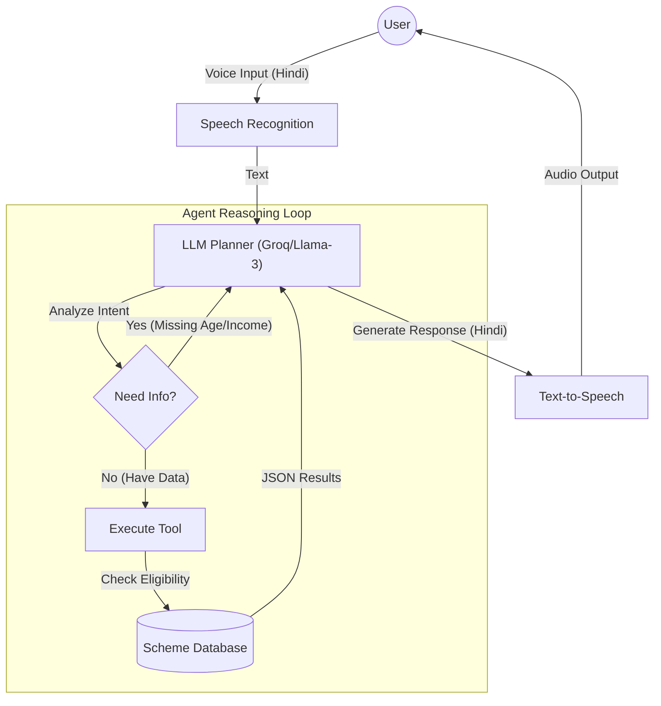

---

# 🇮🇳 Seva (सेवा): Hindi Government Scheme Agent

**Seva** is a voice-first, native Hindi AI agent designed to help Indian citizens identify and understand government welfare schemes. Unlike simple chatbots, Seva utilizes a **Planner-Executor-Evaluator** architecture to autonomously reason, gather missing information (like age or income), and execute tools to determine eligibility in real-time.

---

## 🚀 Key Features

* 
**🎙️ Voice-First Interaction:** Full duplex voice interface using Speech-to-Text (STT) and Text-to-Speech (TTS) for seamless hands-free operation.


* 
**🗣️ Native Hindi Support:** Operates entirely in Hindi (Devanagari script) throughout the pipeline, ensuring accessibility for non-English speakers.


* **🧠 True Agentic Workflow:** Implements the **ReAct (Reason + Act)** pattern. The agent plans its next move—deciding whether to ask a follow-up question or call a tool—rather than following a hardcoded script.


* 
**🛠️ Intelligent Tool Usage:** Equipped with custom tools (`EligibilityCalculator`, `SchemeRetrieval`) to fetch accurate data and prevent hallucinations.


* 
**💾 Conversation Memory:** Maintains context across turns (remembering age/income provided earlier) to handle multi-turn dialogues effectively.


---

## 🏗️ System Architecture

The system follows a modular architecture separating the "Brain" (LLM) from the "Body" (Tools & I/O).



### Core Components

1. **Input Layer:** `SpeechRecognition` library with dynamic energy thresholding to handle ambient noise.
2. **Cognitive Layer:** **Llama-3.3-70b** (via Groq) acts as the reasoning engine, parsing user intent and managing the conversation state.
3. **Tool Layer:** Python functions that interface with a structured JSON database of government schemes.
4. **Output Layer:** `gTTS` (Google Text-to-Speech) mixed with `pygame` for low-latency audio playback.

---

## 📂 Project Structure

```text
hindi-scheme-agent/
├── agent/
│   └── workflow.py       # Manages conversation history and agent state
├── config/
│   ├── settings.py       # API keys and model configurations
│   └── prompts.py        # System prompts enforcing Hindi persona
├── data/
│   └── schemes.json      # Database of schemes (Rules & Details)
├── docs/
│   ├── ARCHITECTURE.md   # Detailed design document
│   └── EVALUATION.md     # Transcript of test scenarios
├── services/
│   ├── llm.py            # Interfaces with Groq API (Planner)
│   └── speech.py         # Handles Microphone & Audio Output
├── tools/
│   └── eligibility.py    # Logic for scheme filtering
├── app.py                # Main entry point (Event Loop)
├── .env                  # Environment variables (API Keys)
├── requirements.txt      # Project dependencies
└── README.md             # Project documentation

```

---

## 🛠️ Installation & Setup

### Prerequisites

* Python 3.9 or higher
* A valid **Groq API Key** (Free tier available)
* Internet connection (for STT/TTS and LLM APIs)

### Step 1: Clone the Repository

```bash
git clone https://github.com/yourusername/hindi-scheme-agent.git
cd hindi-scheme-agent

```

### Step 2: Create Virtual Environment

```bash
# Windows
python -m venv venv
.\venv\Scripts\activate

# Mac/Linux
python3 -m venv venv
source venv/bin/activate

```

### Step 3: Install Dependencies

```bash
pip install -r requirements.txt

```

*Key dependencies:* `groq`, `speechrecognition`, `gTTS`, `pygame`, `python-dotenv`.

### Step 4: Configure Environment

Create a `.env` file in the root directory:

```env
# Get your key from https://console.groq.com
GROQ_API_KEY=gsk_your_actual_api_key_here

```

---

## 🏃‍♂️ Usage

Run the main application file to start the voice agent:

```bash
python app.py

```

### Interaction Guide

1. **Start:** The agent will greet you in Hindi ("नमस्ते...").
2. **Speak:** Ask for a scheme (e.g., *"Mujhe kisan yojana chahiye"*).
3. **Respond:** The agent will ask for details like **Age**, **Income**, and **Occupation**. Answer naturally.
4. **Result:** The agent will process your inputs and speak out the schemes you are eligible for.
5. **Exit:** Say *"Band karo"* or *"Ruk jao"* to stop.

---

## 🧪 Tested Scenarios

The agent has been evaluated against the following scenarios (see `docs/EVALUATION.md` for full transcripts):

| Scenario | User Profile | Expected Outcome | Status |
| --- | --- | --- | --- |
| **Farmer Support** | Age: 45, Income: 2L, Job: Farmer | Suggests *PM Kisan Samman Nidhi* | ✅ Pass |
| **Student Aid** | Age: 19, Income: 0, Job: Student | Suggests *PM Scholarship* | ✅ Pass |
| **Business Loan** | Age: 30, Income: 5L, Job: Business | Suggests *Mudra Yojana* | ✅ Pass |
| **Ineligibility** | Income: 50L (High Income) | politely informs no schemes available | ✅ Pass |

---

## 📄 License

This project is open-source and available under the **MIT License**.

---

### 👨‍💻 Author

**Name:** [RAMASISH PARIDA]
**Contact:** [ramasishparida@gmail.com]
**Submission Date:** December 2025
